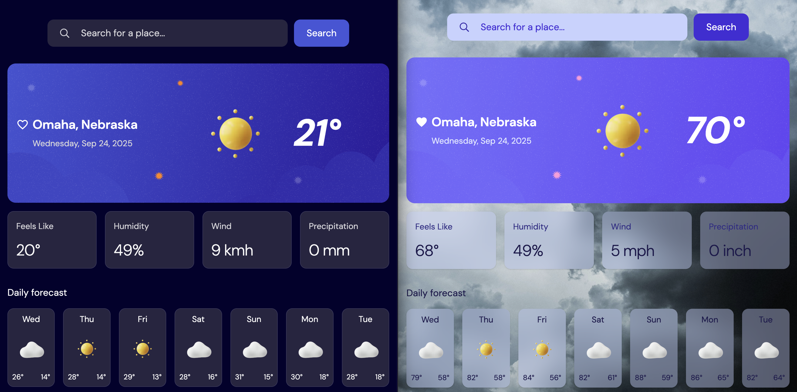

# Frontend Mentor - Weather app solution

This is a solution to the [Weather app challenge on Frontend Mentor](https://www.frontendmentor.io/challenges/weather-app-K1FhddVm49). Frontend Mentor challenges help you improve your coding skills by building realistic projects.

## Table of contents

- [Overview](#overview)
  - [The challenge](#the-challenge)
  - [Screenshot](#screenshot)
  - [Links](#links)
- [My process](#my-process)
  - [Built with](#built-with)
  - [What I learned](#what-i-learned)
  - [Continued development](#continued-development)
- [Author](#author)

## Overview

### The challenge

Users should be able to:

- Search for weather information by entering a location in the search bar
- View current weather conditions including temperature, weather icon, and location details
- See additional weather metrics like "feels like" temperature, humidity percentage, wind speed, and precipitation amounts
- Browse a 7-day weather forecast with daily high/low temperatures and weather icons
- View an hourly forecast showing temperature changes throughout the day
- Switch between different days of the week using the day selector in the hourly forecast section
- Toggle between Imperial and Metric measurement units via the units dropdown
- Switch between specific temperature units (Celsius and Fahrenheit) and measurement units for wind speed (km/h and mph) and precipitation (millimeters) via the units dropdown
- View the optimal layout for the interface depending on their device's screen size
- See hover and focus states for all interactive elements on the page

### Screenshot

### Links

- Solution URL: https://www.frontendmentor.io/solutions/nextjs-react-tailwind-weather-app-9Up6R4YNv8
- Live Site URL: https://cassia-react-weather-app.vercel.app/

## My process

### Built with

- Semantic HTML5 markup
- Mobile-first workflow
- [Tailwind CSS](https://tailwindcss.com/) - CSS framework
- [React](https://reactjs.org/) - JS library
- [Next.js](https://nextjs.org/) - React framework
- [Radix](https://www.radix-ui.com/primitives) - headless UI primitives library
- [Motion](https://motion.dev/docs) - animation library

### What I learned

I learned soooooo much while building this weather app!

- This is my first Typescript app
- This is my first Next.js app
- I created my first custom hook for this app
- This is my first time deploying to Vercel
- I used Radix for the first time to make some tooltips for this app

### Continued development

Things I want/need to learn more about:

- The [Radix](https://www.radix-ui.com/primitives) library
- The [Motion](https://motion.dev/docs) library
- The [Next.js](https://nextjs.org/) framework
- Typescript

## Author

- Website - [Cassia Nebel](https://cassianebel.github.io/)
- Frontend Mentor - [@cassianebel](https://www.frontendmentor.io/profile/cassianebel)
